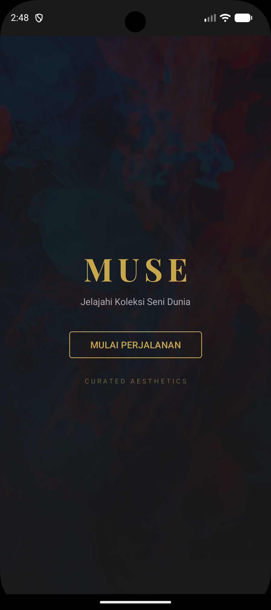
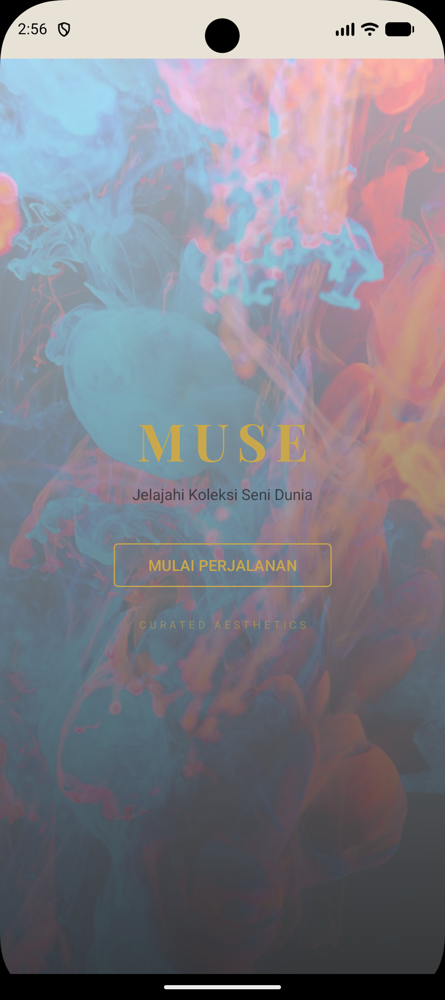

# MUSE — Aplikasi Eksplorasi Koleksi Seni Museum
---

## Deskripsi Aplikasi

MUSE adalah aplikasi Android untuk menjelajahi koleksi karya seni dari Harvard Art Museums. Pengguna dapat menelusuri karya seni dari berbagai era dan budaya, menyimpan karya favorit, serta mencari karya berdasarkan kata kunci atau filter tertentu. Aplikasi dirancang dengan antarmuka premium bergaya museum — dark mode dengan aksen gold dan light mode bernuansa krem hangat.

---

## Screenshots

| Dark Mode | Light Mode |
|---|---|
|  |  |

---
## Fitur Utama

**Beranda (Home)**
- Menampilkan pameran unggulan dan karya terbaru dari API
- Filter koleksi berdasarkan era, asal wilayah, dan tipe karya melalui sidebar
- Tombol refresh untuk memuat data baru

**Pencarian (Search)**
- Pencarian karya berdasarkan kata kunci (judul atau nama seniman)
- Debounce input untuk efisiensi request API
- Tampilan state kosong dan state error koneksi yang berbeda

**Detail Karya**
- Gambar karya resolusi tinggi dengan fitur fullscreen dan pinch-to-zoom
- Informasi lengkap: judul, seniman, tahun, medium, dimensi, deskripsi, lokasi asal
- Koleksi terkait di bagian bawah
- Tombol simpan ke favorit

**Favorit**
- Daftar karya yang disimpan pengguna, tersedia secara offline
- Data diambil dari SQLite lokal tanpa memerlukan koneksi internet

**Profil**
- Statistik penggunaan: koleksi dilihat, favorit tersimpan, total kunjungan
- Edit profil: nama, email, dan foto
- Toggle dark/light theme yang tersimpan antar sesi

---

## Cara Penggunaan

1. Buka aplikasi — splash screen akan muncul
2. Tekan **Mulai Perjalanan** untuk masuk ke halaman utama
3. Jelajahi karya di tab **Home**, gunakan ikon hamburger (≡) untuk membuka filter sidebar
4. Ketuk karya untuk membuka halaman detail
5. Tekan tombol **Simpan ke Favorit** untuk menyimpan karya secara offline
6. Gunakan tab **Search** untuk mencari karya berdasarkan nama atau seniman
7. Tab **Favorit** menampilkan semua karya tersimpan, dapat diakses tanpa internet
8. Tab **Profil** untuk mengatur tema dan informasi pengguna

---

## Implementasi Teknis

### Activity & Intent
Aplikasi memiliki tiga Activity:
- `MainActivity` — Launcher, menampilkan splash screen, berpindah ke `HomeActivity` via Intent eksplisit
- `HomeActivity` — Host utama untuk semua Fragment via `BottomNavigationView`
- `DetailActivity` — Menampilkan detail karya, menerima data dari Intent (`artwork_id`, `title`, `image_url`, `artist`, `date`)

### Fragment & Navigation Component
Empat Fragment dikelola oleh `NavController` di dalam `HomeActivity`:
- `HomeFragment` — Pameran unggulan dan karya terbaru
- `SearchFragment` — Pencarian dengan debounce dan state management
- `FavoritFragment` — Grid karya favorit dari SQLite
- `UserFragment` — Profil dan pengaturan

### RecyclerView
Digunakan di seluruh layar utama dengan adapter terpisah:
- `FeaturedArtworkAdapter` — Kartu horizontal di Home
- `RecentArtworkAdapter` — Daftar vertikal di Home
- `SearchArtworkAdapter` — Grid hasil pencarian
- `FavoriteAdapter` — Grid karya favorit
- `RelatedArtworkAdapter` — Kartu horizontal di Detail

### Background Thread
Semua operasi network dan database dijalankan menggunakan `ExecutorService` dengan hasil dikembalikan ke UI thread melalui `Handler(Looper.getMainLooper())`. Tidak menggunakan `AsyncTask` (deprecated) maupun `LiveData`.

```java
ExecutorService executor = Executors.newFixedThreadPool(3);
Handler handler = new Handler(Looper.getMainLooper());

executor.execute(() -> {
    // Operasi network/database di background
    handler.post(() -> {
        // Update UI di main thread
    });
});
```

### Networking — Retrofit + Harvard Art Museums API
Data karya seni diambil dari **Harvard Art Museums API** menggunakan Retrofit dengan `GsonConverterFactory`. API key disimpan di `gradle.properties` dan diakses melalui `BuildConfig.HARVARD_API_KEY`.

Endpoint utama yang digunakan:
```
GET /object?apikey=...&hasimage=1&imagepermissionlevel=0&classification=Paintings&sortby=totalpageviews
GET /object?apikey=...&keyword={query}&hasimage=1
GET /object/{id}?apikey=...
GET /object?apikey=...&classification=...&culture=...&century=...
```

Kondisi tidak ada jaringan ditangani dengan menampilkan Snackbar dan tombol **Coba Lagi** yang memanggil ulang fungsi fetch.

### Local Data Persistent

**SQLite** — menyimpan karya favorit pengguna melalui `DatabaseHelper` dan `FavoriteDao`:
```sql
CREATE TABLE favorites (
    id          INTEGER PRIMARY KEY,
    title       TEXT NOT NULL,
    artist      TEXT,
    date_display TEXT,
    medium      TEXT,
    image_url   TEXT,
    description TEXT,
    saved_at    INTEGER
);
```

**SharedPreferences** (`muse_prefs`) — menyimpan:
- `theme_mode` — preferensi dark/light theme
- `user_name`, `user_email`, `user_avatar` — data profil pengguna
- `stat_viewed_ids` — Set ID karya yang pernah dibuka
- `stat_visit_count` — Total kunjungan ke halaman detail

### Dark / Light Theme
Dua tema didefinisikan di `res/values/themes.xml` dan `res/values-night/themes.xml` menggunakan Material Design 3. Toggle di `UserFragment` menyimpan preferensi ke SharedPreferences dan menerapkan tema via `AppCompatDelegate.setDefaultNightMode()`.

---

## Struktur Folder

```
app/src/main/java/com/example/muse/
├── activity/
│   ├── MainActivity.java
│   ├── HomeActivity.java
│   ├── DetailActivity.java
│   └── EditProfileActivity.java
├── fragment/
│   ├── HomeFragment.java
│   ├── SearchFragment.java
│   ├── FavoritFragment.java
│   └── UserFragment.java
├── adapter/
│   ├── FeaturedArtworkAdapter.java
│   ├── RecentArtworkAdapter.java
│   ├── SearchArtworkAdapter.java
│   ├── FavoriteAdapter.java
│   └── RelatedArtworkAdapter.java
├── network/
│   ├── RetrofitClient.java
│   └── ApiService.java
├── database/
│   ├── DatabaseHelper.java
│   └── FavoriteDao.java
└── model/
    ├── HarvardArtwork.java
    ├── HarvardPerson.java
    ├── HarvardColor.java
    ├── HarvardListResponse.java
    ├── HarvardInfo.java
    ├── Favorite.java
    └── FilterOptions.java
```

---

## Teknologi yang Digunakan

| Komponen | Library / Tool |
|---|---|
| Bahasa | Java |
| UI | Material Design 3, ViewBinding |
| Navigasi | Jetpack Navigation Component |
| Network | Retrofit 2 + OkHttp + Gson |
| Image Loading | Glide 4.16 |
| Image Zoom | PhotoView (chrisbanes) |
| Database | SQLite (native Android) |
| Preferensi | SharedPreferences |
| API | Harvard Art Museums API |

---

## Cara Menjalankan Project

1. Clone repository ini
2. Buka dengan Android Studio (versi Hedgehog atau lebih baru)
3. Tambahkan API key di `gradle.properties`:
   ```
   HARVARD_API_KEY=your_api_key_here
   ```
   Daftar API key gratis di: https://harvardartmuseums.org/collections/api
4. Sync Gradle: **File → Sync Project with Gradle Files**
5. Jalankan di emulator atau device fisik (minSdk 24)

---

## Spesifikasi Teknis Terpenuhi

| Spesifikasi | Implementasi |
|---|---|
| Minimal 2 Activity | MainActivity, HomeActivity, DetailActivity, EditProfileActivity |
| Intent | Perpindahan MainActivity → HomeActivity, semua Fragment → DetailActivity |
| RecyclerView | 5 adapter berbeda di seluruh layar |
| Fragment (min. 2) | 4 Fragment dikelola NavController |
| Background Thread | ExecutorService + Handler di semua operasi async |
| Networking + Retrofit | Harvard Art Museums API, tombol refresh saat offline |
| SQLite | Tabel favorites untuk data offline |
| SharedPreferences | Tema, profil, statistik pengguna |
| Dark / Light Theme | Dua tema Material 3, toggle di halaman profil |

---

## Informasi Tugas

- Mata Kuliah: Lab Mobile 2026
- Tema: Pendidikan
- Deadline Pengumpulan: 12 Juni 2026
- Deadline Presentasi: 17 Juni 2026
